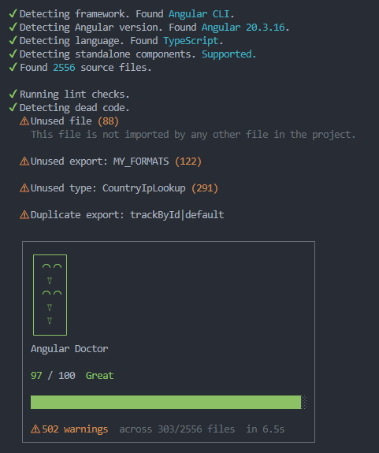

# Angular Doctor

Diagnose and improve Angular codebases with a single command.

Angular Doctor scans your project for **Angular-specific lint issues** and **dead code**, then produces a **0–100 health score** plus actionable diagnostics.

---

## ✨ Features

- **Angular-aware linting** (components, directives, pipes, performance, architecture, TypeScript)
- **Dead code detection** (unused files, exports, types) via [knip](https://knip.dev)
- **Workspace support** (Angular CLI + npm/pnpm workspaces)
- **Diff mode** to scan only changed files
- **Markdown reports** for sharing results

---

## ✅ Quick start

Run at your Angular project root (or workspace root):

```bash
npx -y angular-doctor@latest .
```



Generate a Markdown report in the current directory:

```bash
npx -y angular-doctor@latest . --report .
```

Show affected files and line numbers:

```bash
npx -y angular-doctor@latest . --verbose
```

---

## 🤖 Install for your coding agent

Teach your coding agent to run Angular Doctor automatically after every Angular change:

```bash
curl -fsSL https://raw.githubusercontent.com/antonygiomarxdev/angular-doctor/main/install-skill.sh | bash
```

Supports **Cursor**, **Claude Code**, **Windsurf**, **Amp Code**, **Codex**, **Gemini CLI**, and **OpenCode**.

Once installed, your agent will automatically run:

```bash
npx -y angular-doctor@latest . --verbose --diff
```

…after making Angular changes, catching issues before they reach review.

---

## 🧭 Workspace support

Angular Doctor automatically detects multiple projects:

- **Angular CLI workspaces** — reads `angular.json` and scans each project inside `projects/`
- **npm / pnpm workspaces** — detects packages with `@angular/core` from `workspaces` or `pnpm-workspace.yaml`

When multiple projects are found:

- **Interactive mode**: prompts for which projects to scan
- **Non-interactive mode** (`-y`, CI): scans all detected projects

Target a specific project (comma-separated for multiple):

```bash
npx -y angular-doctor@latest . --project my-app,my-lib
```

---

## ⚙️ CLI Options

```
Usage: angular-doctor [directory] [options]

Options:
  -v, --version         display the version number
  --no-lint             skip linting
  --no-dead-code        skip dead code detection
  --verbose             show file details per rule
  --score               output only the score
  --report [path]       write a markdown report (optional output path)
  --fast                speed up by skipping dead code and type-aware lint
  -y, --yes             skip prompts, scan all workspace projects
  --project <name>      select workspace project (comma-separated for multiple)
  --diff [base]         scan only files changed vs base branch
  -h, --help            display help for command
```

---

## 📝 Reports

Use `--report` to write a Markdown report:

- `--report` writes to the diagnostics temp folder
- `--report .` writes to the current project directory
- `--report ./reports` writes to a custom folder
- `--report ./reports/scan.md` writes to a specific file

---

## 🔧 Configuration

Create an `angular-doctor.config.json` in your project root:

```json
{
  "ignore": {
    "rules": ["@angular-eslint/prefer-standalone"],
    "files": ["src/generated/**"]
  }
}
```

Or use the `angularDoctor` key in `package.json`:

```json
{
  "angularDoctor": {
    "ignore": {
      "rules": ["@angular-eslint/prefer-standalone"]
    }
  }
}
```

### Config options

| Key | Type | Default | Description |
|-----|------|---------|-------------|
| `ignore.rules` | `string[]` | `[]` | Rules to suppress using the `plugin/rule` format |
| `ignore.files` | `string[]` | `[]` | File paths to exclude, supports glob patterns |
| `lint` | `boolean` | `true` | Enable/disable lint checks |
| `deadCode` | `boolean` | `true` | Enable/disable dead code detection |
| `verbose` | `boolean` | `false` | Show file details per rule |
| `diff` | `boolean | string` | — | Scan only changed files |

---

## 📦 Node.js API

```typescript
import { diagnose } from "angular-doctor/api";

const result = await diagnose("./path/to/your/angular-project");

console.log(result.score);       // { score: 82, label: "Great" }
console.log(result.diagnostics); // Array of Diagnostic objects
console.log(result.project);     // Detected framework, Angular version, etc.
```

Each diagnostic has the following shape:

```typescript
interface Diagnostic {
  filePath: string;
  plugin: string;
  rule: string;
  severity: "error" | "warning";
  message: string;
  help: string;
  line: number;
  column: number;
  category: string;
}
```

---

## 🧪 What it checks

### Components
- Missing `Component` / `Directive` class suffixes
- Empty lifecycle methods
- Missing lifecycle interfaces
- Pipe not implementing `PipeTransform`

### Performance
- Missing `OnPush` change detection strategy
- Outputs shadowing native DOM events

### Architecture
- Conflicting lifecycle hooks (`DoCheck` + `OnChanges`)
- Use of `forwardRef`
- Renamed inputs/outputs
- Inline `inputs`/`outputs` metadata properties
- Non-standalone components (Angular 17+)

### TypeScript
- Explicit `any` usage

### Dead Code
- Unused files
- Unused exports and types

---

## 💡 Inspiration

Inspired by [react-doctor](https://github.com/millionco/react-doctor).

---

## 📄 License

MIT
